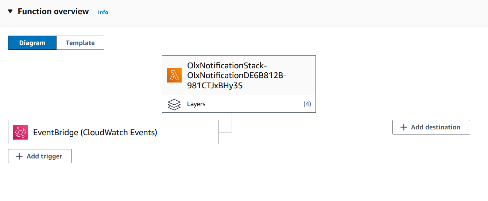
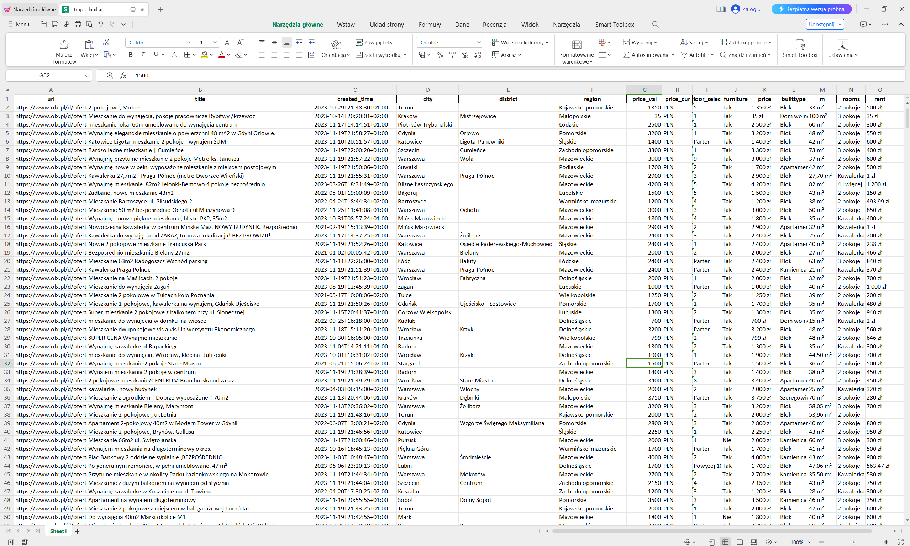

[![Contributors][contributors-shield]][contributors-url]
[![Forks][forks-shield]][forks-url]
[![Stargazers][stars-shield]][stars-url]
[![Issues][issues-shield]][issues-url]
[![MIT License][license-shield]][license-url]
[![LinkedIn][linkedin-shield]][linkedin-url]


<br />
<div align="center">

  <h2 align="center">OLX Notification</h3>
  <p align="center">
    Get your daily offers on email.
    <br />
    <br />
    <a href="https://github.com/DEENUU1/olx-notification/issues">Report Bug</a>
    ·
    <a href="https://github.com/DEENUU1/olx-notification/issues">Request Feature</a>
  </p>

  <a href="https://github.com/DEENUU1/">

  </a>
</div>





<!-- ABOUT THE PROJECT -->
## About The Project
OLX Notification allows you to collect data from the olx.pl portal on a daily basis and then send this data to the indicated address.

The whole thing is based on the public API provided by OLX and AWS Lambda, which allows automatic code execution at a given time.

The data is sent by e-mail as an Excel file.

### Key Features
1. Scraping data from olx.pl
2. Serverless architecture - AWS Lambda
3. Saving scraped data to excel file 
4. Send data by an e-email


## Built With

- Python
  - Pandas
  - Openpyxl
  - Requests
- AWS Lambda

## Installation
Tutorials
```bash
https://www.youtube.com/watch?v=o3s4VqlMsT8&t=228s - AWS CDK configuration

https://aws.plainenglish.io/lambda-layer-how-to-create-them-python-version-bc1e027c5fea - How to add python library by using .zip format 
```

1. Clone git repository
```bash
git clone https://github.com/DEENUU1/science.git
```

2. Install all requirements
```bash
pip install -r requirements.txt
```

3. Add url from which you want to scrape data
```bash
olx_notification/olx.py

URLS_TO_SCRAPE = {
    "Łódź mieszkania wynajem": "https://www.olx.pl/api/v1/offers/?offset=40&limit=40&category_id=15&sort_by=created_at%3Adesc&filter_refiners=spell_checker&sl=18ae25cfa80x3938008f",
    "Next your": "https://www.olx.pl/"

}
```

- To get url go to olx.pl
- Choose category for example - `Nieruchomości`
- Choose what you need for example (use all filters you need):
  - `Mieszakania`
  - `Wynajem`
  - `Warszawa` 
- Click the right button on your mouse and open devtools 
- Go to `Network` and refresh the page `F5`
- Scroll to the bottom and go to 2 page 
- Scroll to the bottom again and filter the results in `Network` by the `Type`
- Find the object that looks like this

- Click on this object and copy link and paste to the `olx.py` file inside `URLS_TO_SCRAPE` dictionary

4. Download AWS CLI
```bash
https://docs.aws.amazon.com/cdk/v2/guide/getting_started.html 
````

5. Configure AWS CLI
```bash
aws configure 
```

6. Install aws-cdk (npm is required)
```bash
npm install -g aws-cdk@latest
```
7. Bootstrap
```bash
cdk bootstrap aws://<your_account_id>/<your_location>
```
8. Deploy code to AWS Lambda
```bash
cdk deploy 
```
9. AWS Lambda configuration 
- Go to Lambda/Functions/OlxNotificationStack....
- Click on `Configuration`
  - Go to `General configuration` and click `edit`
  - Change `Timeout` (I set this on 1 min)
  - Go to `Environment variables` and add (Key: value)
  
    `To get an SMTP_PASSWORD you need to go to the Security -> 2 step verification -> Password to application -> Copy generated password`
    - FROM_EMAIL: your gmail email
    - SMTP_PASSWORD: email to your gmail account 
    - SMTP_USERNAME: your gmail email
    - TO_MAIL: your email 
- Now back to your AWS Lambda function and scroll to the bottom to get `Layers` section
- Click `Add a layer`
  - Choose an `Specify an ARN` and by using this you are able to add 2 packages - `requests` and `pandas`
  Check this link to search for your ARN key https://github.com/keithrozario/Klayers/tree/master/deployments/python3.9
  You need to choose your python version and region
  - Then you need to install `openpyxl`
  ```bash
  mkdir proj  (create a new folder)
  cd .\proj\  (go to this folder)
  python -m venv venv  (create python env)
  venv\Scripts\activate  (activate python env)
  mkdir python  (inside proj directory create a folder called python)
  cd python
  pip install openpyxl -t .  (install package)
  ```
  - After this few commands go to this directory and save `python` folder to .zip file
  - Now go to `Layers` and click `Create layer`
    - Add some name, choose a .zip file (upload python.zip), choose x86_64 and arm64 and choose the correct version of a python in `Runtimes`
  - Go back to your AWS Lambda function 
  - Click `Add a layer` and select `Custom layers`
  - Select the layer that you created and click `add`

10. Use EventBridge
- To run this script everyday whe to use EventBridge
- Go to your function in AWS Lambda and choose `Add trigger`
- Then select `EventBridge (CloudWatch Events)`
- Choose `Create a new rule`
  - Add some name 
  - Choose `Schedule expression`
  - In `Schedule expression add this` - `cron(0 14 ? * MON-SAT *)`
  - Click `Add`

Thanks to this configuration the script is gonna run every day at 14 pm

<!-- LICENSE -->
## License

See `LICENSE.txt` for more information.


<!-- MARKDOWN LINKS & IMAGES -->
<!-- https://www.markdownguide.org/basic-syntax/#reference-style-links -->
[contributors-shield]: https://img.shields.io/github/contributors/DEENUU1/olx-notification.svg?style=for-the-badge
[contributors-url]: https://github.com/DEENUU1/olx-notification/graphs/contributors
[forks-shield]: https://img.shields.io/github/forks/DEENUU1/olx-notification.svg?style=for-the-badge
[forks-url]: https://github.com/DEENUU1/olx-notification/network/members
[stars-shield]: https://img.shields.io/github/stars/DEENUU1/olx-notification.svg?style=for-the-badge
[stars-url]: https://github.com/DEENUU1/olx-notification/stargazers
[issues-shield]: https://img.shields.io/github/issues/DEENUU1/olx-notification.svg?style=for-the-badge
[issues-url]: https://github.com/DEENUU1/olx-notification/issues
[license-shield]: https://img.shields.io/github/license/DEENUU1/olx-notification.svg?style=for-the-badge
[license-url]: https://github.com/DEENUU1/olx-notification/blob/master/LICENSE.txt
[linkedin-shield]: https://img.shields.io/badge/-LinkedIn-black.svg?style=for-the-badge&logo=linkedin&colorB=555
[linkedin-url]: https://linkedin.com/in/kacper-wlodarczyk
